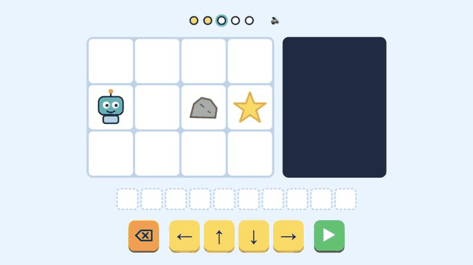

# Robô pega a estrela

Jogo de navegador para apresentar o curso de Engenharia de Software da UNIPAMPA a crianças. A criança monta uma sequência de setas, aperta play e o robô anda pela grade até a estrela. Se o robô bater numa pedra, o passo errado fica vermelho e a criança conserta só esse passo.

**[Jogar agora](https://paulosevero.github.io/robo-estrela/)**

## O que o jogo ensina

O jogo mostra três partes do trabalho de quem faz software:

- Programar é montar a sequência de passos.
- Testar é apertar play e ver o que o robô faz.
- Depurar é achar o passo que causou o erro e trocá-lo.

Ao lado da grade, cada seta aparece também como uma linha de código, como `robô.direita()`, para mostrar que a fila de setas já é um programa. O jogo usa só ícones, cores e sons, então funciona com crianças que ainda não leem.

## Como jogar

| Tecla                     | Ação                                                 |
| ------------------------- | ---------------------------------------------------- |
| ← ↑ ↓ →                   | Acrescenta um passo                                  |
| Backspace                 | Apaga o passo vermelho ou, se não houver, o último   |
| Enter ou Espaço           | Executa a fila e avança para o próximo nível         |
| 1 a 5, Page Up, Page Down | Troca de nível                                       |
| R                         | Limpa a fila                                         |
| M                         | Liga e desliga o som                                 |
| Q                         | Mostra em tela cheia o QR code para jogar no celular |

No celular e no tablet, os mesmos comandos estão nos botões da tela, e tocar num passo da fila apaga esse passo. Ao vencer um nível, a criança ganha 3 estrelas se usou o caminho mais curto, 2 estrelas com até dois passos a mais e 1 estrela nos outros casos.

## Roteiro da apresentação

1. Aquecimento sem tela. Uma criança faz o papel do robô no chão, e as outras dão comandos com cartões de seta até ela pegar uma estrela de papel.
2. Jogo no projetor. As crianças se revezam nos cinco níveis usando o teclado do notebook.
3. Fechamento. O apresentador conta que o erro do robô se chama bug e que consertar bugs faz parte do trabalho de quem estuda Engenharia de Software. A tela final mostra os destaques do curso e dois QR codes, um para jogar no celular e outro para o site do curso.

## Como rodar e editar

O jogo é um único arquivo, `index.html`, feito com HTML, CSS e JavaScript puros, sem bibliotecas. Ele funciona sem internet, então basta abrir o arquivo no navegador com duplo clique. Os sons são gerados pelo próprio navegador, com a Web Audio API.

Os níveis ficam na lista `LEVELS`, no início do script. Cada nível é uma lista de linhas de texto em que `R` é o robô, `*` é a estrela, `#` é uma pedra e `.` é uma casa livre. Ao mudar um nível, atualize também o número de passos do caminho mais curto na lista `FEWEST_STEPS`, que decide as estrelas.

## Programação em Dupla

A pasta `dupla/` tem um jogo para duas pessoas, com o mesmo visual. Ele mostra como funciona a programação em dupla, em que uma pessoa escreve o código e a outra revisa e orienta.

**[Jogar a Programação em Dupla](https://paulosevero.github.io/robo-estrela/dupla/)**

- O **piloto** monta as setas do robô, como no jogo da estrela, mas os bugs do tabuleiro ficam escondidos para ele.
- O **navegador** escaneia o QR code da primeira tela e vê no celular o mapa com todos os bugs. Ele diz o caminho ao piloto e avisa onde estão os bugs.
- Se o robô pisa num bug, o bug aparece, o passo errado fica vermelho e a dupla conserta só esse passo.
- A dupla ganha 3 estrelas se chegar na primeira tentativa e uma estrela a menos a cada nova tentativa. Ao fim de cada nível, as duas pessoas trocam de papel.

Na primeira tela, a dupla escolhe a dificuldade, e cada uma tem 5 fases:

- 🌱 **Fácil:** tabuleiros de 3×4 a 6×6, com mais de um caminho seguro.
- ⚡ **Normal:** tabuleiros de 5×5 a 6×6, com caminhos de 8 a 12 passos. Em cada fase só existe um caminho seguro mais curto, e nenhum caminho em linha reta escapa dos bugs.
- 🔥 **Desafio:** tabuleiros de 6×6 a 7×7, com mais bugs, caminhos de 10 a 12 passos que exigem voltas, e sem a opção de espiar.

Quem joga sozinho pode tocar em 👀, ou apertar E, para ver os bugs por 2 segundos, ao custo de uma estrela. A tecla Q mostra em tela cheia o QR code do navegador. O mapa do navegador é a mesma página aberta com `?navegador` no fim do endereço. Ali, os botões do topo trocam a dificuldade, e as setas, os pontos ou um deslize trocam a fase. As fases ficam na lista `DIFFICULTIES`, em que `B` marca um bug escondido, e a fila aceita até 12 passos.

## Licença

Código sob a licença MIT. Veja o arquivo [LICENSE](LICENSE).

## Créditos

Feito para divulgar o curso de [Engenharia de Software da UNIPAMPA](https://cursos.unipampa.edu.br/cursos/engenhariadesoftware/), no Campus Alegrete.
